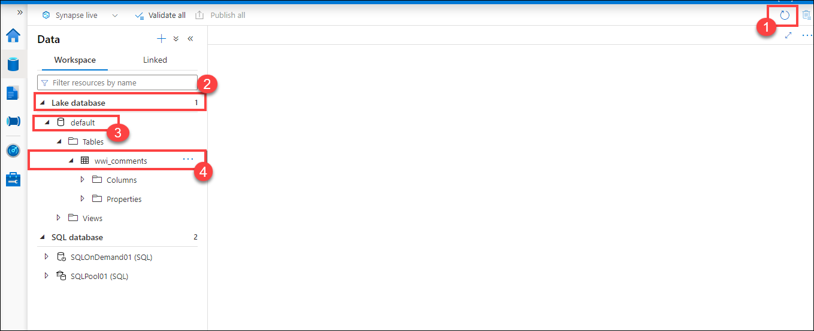
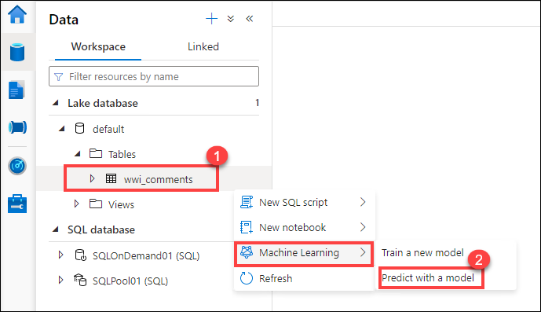
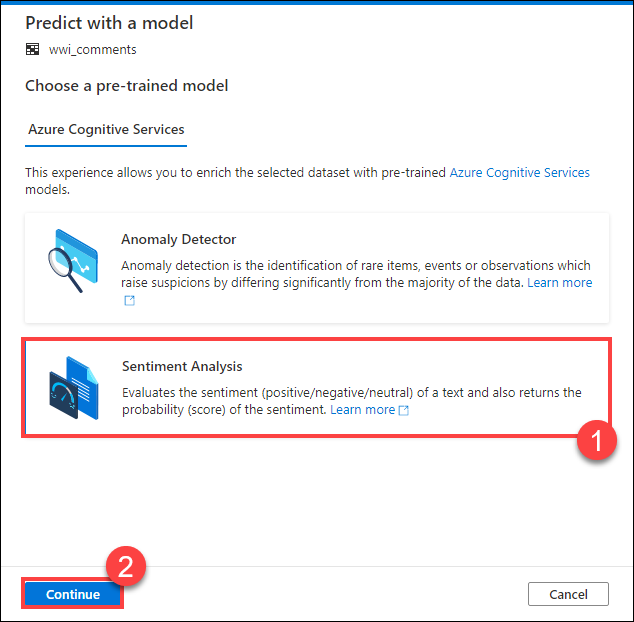

# Exercise 5 - Data Science with Azure Synapse Spark (Optional)

Azure Synapse Analytics provides support for using trained models (in ONNX format) directly from dedicated SQL pools. What this means in practice, is that your data engineers can write T-SQL queries that use those models to make predictions against tabular data stored in a SQL Pool database table.

In this exercise, you will leverage a previously trained model to make predictions using the T-SQL `Predict` statement.

For context, the following are the high-level steps taken to create a Spark ML based model and deploy it, so it is ready for use from T-SQL.


The steps are performed using a combination of Azure Databricks and Azure Synapse Analytics workspaces:

- Within a Databricks notebook, a data scientist will:

  a. Train a model using Spark ML; the machine learning library included with Apache Spark. Models can also be trained using other approaches, including by using Azure Machine Learning automated ML. The main requirement is that the model format must be supported by ONNX.

  b. Convert the model to the ONNX format using the `onnxml` tools.

  c. Save a hexadecimal encoded version of the ONNX model to a table in the SQL Pool database.

- To use the model for making predictions in Synapse Analytics, in a SQL Script, a data engineer will:

  a. Read the model into a binary variable by querying it from the table in which it was stored.

  b. Execute a query using the `FROM PREDICT` statement as you would a table. This statement defines both the model to use and the query to execute that will provide the data used for prediction. You can then take these predictions and insert them into a table for use by downstream analytics applications.

> What is ONNX? [ONNX](https://onnx.ai/) is an acronym for the Open Neural Network eXchange and is an open format built to represent machine learning models, regardless of what frameworks were used to create the model. This enables model portability, as models in the ONNX format can be run using a wide variety of frameworks, tools, runtimes, and platforms. Think of it as a universal file format for machine learning models.

In this exercise, the tasks you will perform are:

- Exercise 5 - Data Science with Spark
  - Task 1 - Making predictions with a trained model
  - Task 2 - Examining the model training and registration process (Optional)

## Task 1 - Making predictions with a trained model

In this task, you will author a T-SQL query that uses a pre-trained model to make predictions.

1. Open Synapse Analytics Studio, and then navigate to the `Data` hub.

2. Expand the Databases listing, right-click your dedicated SQL Pool and then select `New SQL Script`, and then `Empty script`.

   

3. Replace the contents of this script with following:

   ```sql
   -- Retrieve the latest hex encoded ONNX model from the table
   DECLARE @model varbinary(max) = (SELECT Model FROM [wwi_ml].[MLModel] WHERE Id = (SELECT Top(1) max(ID) FROM [wwi_ml].[MLModel]));

   -- Run a prediction query
   SELECT d.*, p.*
   FROM PREDICT(MODEL = @model, DATA = [wwi].[SampleData] AS d, RUNTIME = ONNX) WITH (prediction real) AS p;
   ```

4. Select **Run** from the menubar.

   

5. View the results, notice that the `Prediction` column is the model's prediction of how many items of the kind represented by `StockItemKey` that the customer identified by `CustomerKey` will purchase.

   

## Task 2 - Examining the model training and registration process (Optional)

You can see the notebook and SQL scripts used to train and register this model if you are curious. To do so, follow these steps:

1. Go back to your resource group and select the Azure Databricks service.

   

2. Once in the Databricks Service's Overview section, select **Launch Workspace** to navigate to your  Databricks workspace.

   

3. Open the **Workspace (1)** section from the left menu. Under **Shared (2)**, select the notebook called `Exercise 5 - Model Training` **(3)**.

   

   This notebook handles training the model, converting the model to ONNX, and uploading the ONNX model to Azure Storage.

4. To execute the notebook, follow the instruction in the notebook **(1)** to mount your Azure Storage accounts to Azure Databricks. Finally, pick a cluster **(2)** and select **Run all (3)**. This will train a Machine Learning model in ONNX format.  

   

5. One step that is not shown by the notebook is an offline step that converts the ONNX model to hexadecimal. The resulting hex-encoded model is also uploaded to Azure Storage. This conversion is currently performed with [this PowerShell script](https://raw.githubusercontent.com/SpektraSystems/azure-synapse-analytics-day/v2/artifacts/00/ml/convert-to-hex.ps1), but could be automated using any scripting platform.

6. Once you have read through the notebook, return to the `Develop` hub, expand **SQL scripts** and select `Exercise 5 - Register model`. View, but **do not run this script**.

7. This script uses PolyBase to load the hex-encoded model from Azure Storage into a table within the SQL Pool database. Once the model is inserted into the table in this way, it is available for use by the Predict statement as was shown in Task 1.

## Task 3 - Code free artificial intelligence

In this task, you will be implementing sentiment analysis in Synapse without writing any code. The fully integrated data enrichment capabilities powered by Azure Cognitive Services allow Synapse users to enrich data and gain insights by leveraging state-of-the-art pre-trained AI models. Today, two models available through the Synapse workspace are Text Analytics (Sentiment Analysis) and Anomaly detector. Your lab environment already has an Azure Cognitive Services account provisioned for your use. The following steps will take you through the quick implementation in Synapse.

1. Open Synapse Analytics Studio, and then navigate to the **Data (1)** hub.

2. Switch to the Linked data connections and select your primary data lake. Navigate to **dev > Bronze (4)** folder. Right-click **wwi-comments.csv (5)** file and select **New notebook (6) > New Spark table (7)** to continue.

   

3. Once you are in the auto-generated notebook, make sure `, header=True` is uncommented **(2)**. Attach a spark pool **(1)** to your notebook and run the current cell by selecting the play button **(3)** on the left.

   

   `saveAsTable` stores a persistent table copy of the dataframe into Hive metastore. In this case, the Spark database name is `default`, and the table name is `wwi_comments` **(4)**.

4. In order to see the newly created Spark database refresh the **Databases (2)** list. Select **default (3)** and find the **wwi_comments (4)** table in the tables collection.

   

5. Right click the **wwi_comments** spark table and select **Machine Learning > Predict with a model (2)** command.

   

6. Select **Text Analytics - Sentiment Analysis (1)** from the list of enrichments based on Azure Cognitive Services. Select **Continue (2)** to proceed.

   

7. Select your lab Cognitive Service account **(1)** and the Key Vault named `KeyVault` **(2)**. The access key for the Cognitive Service account is stored in the key vault. The name for the secret is `CognitiveKey`. Set **Secret name (3)** to **CognitiveKey**. Select **Continue (4)** to proceed.

   

8. Our comments to be analyzed for sentiments are in English. So, we will set the language setting to **English (1)**. Next, pick the text column that has the source data. In our case, it is the **comment (2)** field. Select **Open notebook (3)** to continue.

   

9. Attach your notebook to a Spark pool **(1)** and run all cells by selecting the **Run all (2)** button. Observe the code in the cells where the secret key is pulled from KeyVault and used to access Azure Cognitive Services to run sentiment analysis. You can see the resulting sentiment scores in the sentiment column (3) in the output.

   
